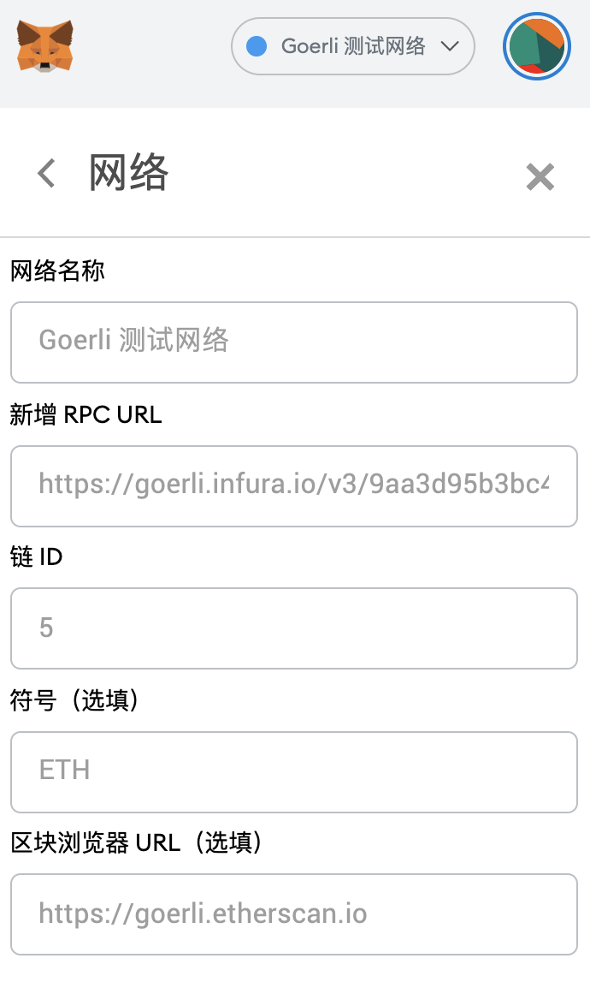
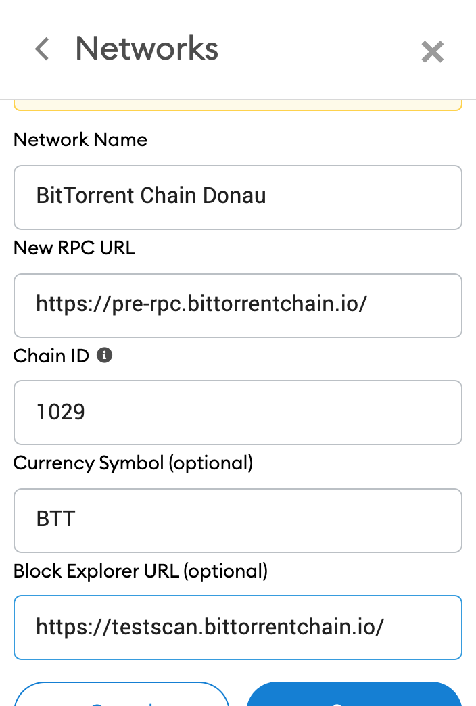

# BTTC Testnet Configuration

Following testnets are used together with the BTTC testnet:

* TRON：Nile Testnet
* ETH：Goerli Testnet
* BSC：BSC Testnet

## Testnet Faucet

| Network  |  Test network name |  URL |  Note |
| ------------ | ------------ | ------------ | ------------ |
| TRON  | Nile  |  [Nile Faucet](https://nileex.io/join/getJoinPage) |   |
|  ETH |  Goerli | [Goerli Faucet](https://faucet.goerli.mudit.blog/)  | Twitter |
|  BSC |  BSC Testnet | [BSC Faucet](https://testnet.binance.org/faucet-smart)  |   |
|  BTTC | BTTC Testnet | [BTTC Faucet](https://faucet.bittorrentchain.io)  |  |

## TRON

Full Node: https://api.nileex.io
Event Server: https://event/nilllex.io

### Test Coin Application

## ETH

Network Name: Goerli - Testnet
New RPC URL: https://goerli.infura.io/v3/9aa3d95b3bc440fa88ea12eaa4456161
ChainID: 5
Symbol: ETH
Block Explorer URL: https://goerli.etherscan.com

### Test Coin Application

## BSC

Network Name: Binace Smart Chain - Testnet
New RPC URL: https://data-seed-prebsc-1-s1.binance.org:8545/
ChainID: 97
Symbol: BNB
Block Explorer URL: https://testnet.bscscan.com

### Test Coin Application

## BTTC

Network Name: BitTorrent Chain Testnet
New RPC URL: https://test-rpc.bittorrentchain.io/ 
ChainID: 1028
Symbol: BTT
Block Explorer URL: https://scan.bittorrentchain.io/

### Test Coin Application

