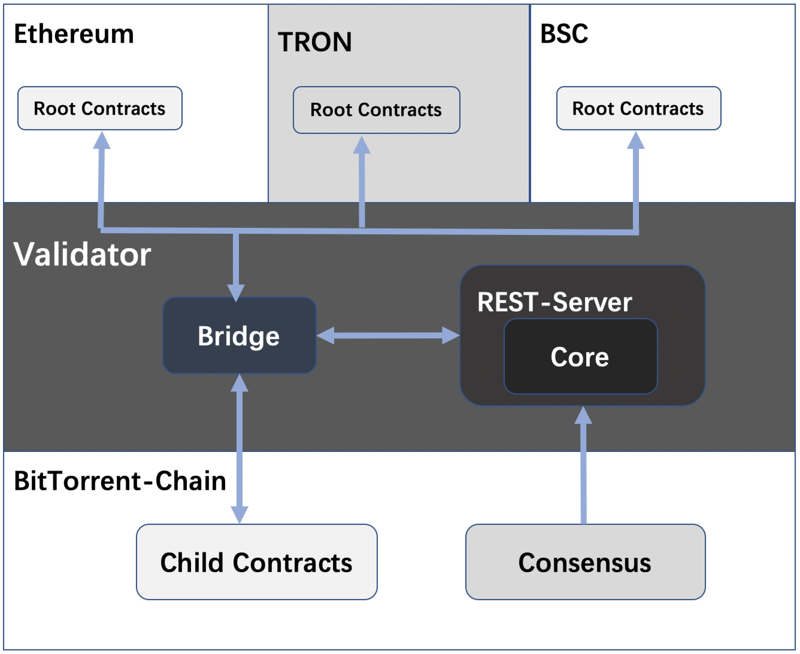

# Validator

## Introduction

A Validator (Validator) is a participant in the network that helps run the network by locking BTT tokens in the system and running Validator nodes. The Super Delegates use their BTT tokens as collateral to maintain network security and to exchange their services for rewards.

The BitTorrent-Chain relies on a set of super delegates to protect the network. The role of a super delegate is to run a full node, produce blocks on the main chain, verify and participate in consensus and submit Checkpoint.

Delegations are also recorded in the staking contract, and any updates to the verifier powers or node signer addresses or unbinding requests take effect immediately when the next checkpoint is submitted.

At each checkpoint, rewards are distributed proportionally to all pledges, except for the proposer who receives an additional bonus. The user reward balance is updated in the contract referenced at the time the reward is requested.

Equity is at risk of being reduced if a Validator node commits a malicious act such as double signing, which also affects the linked principals for that checkpoint.

## Architecture

The BitTorrent-Chain is a blockchain application platform with an overall structure divided into three layers.

* Root Contracts layer: Root contracts on TRON and other blockchain networks will support functions of staking, mapping tokens to BitTorrent-Chain by depositing/withdrawing funds, etc.
* Validator layer: Validates BitTorrent-Chain blocks and periodically sends checkpoints to the TRON and other supported blockchain networks.

              Bridge: Responsible for listening to events on each chain, sending event   messages, etc.

              Core: Consensus module, including verification of Checkpoint (snapshot of BitTorrent-Chain chain state), consensus of Statesync events & Staking events.  

              REST-Server: Provides related API services.

* BitTorrent-Chain layer.

## Functions

A Blockchain Validator is the person responsible for verifying transactions within the blockchain. For BitTorrent-Chain, any participant is eligible to become a BitTorrent-Chain Validator, earning rewards and transaction fees by running a full node. To ensure good participation by the Validator, they lock in a number of their BTT tokens as shares in the ecosystem.

BitTorrent-Chain's Validators are selected through an on-chain stake, a process that takes place periodically. These selected super-representatives participate as block producers and validators. Once a checkpoint (a set of blocks) has been verified by a participant, it is then updated on TRON & Ether & BSC and a reward is issued for the super-representative based on his or her shares in the network.

### Duties of the Validator

* Join the network by locking in BTT tokens in a stake contract on TRON.
* Validators can exit the system at any time, which can be done by unstake executing transactions on the contract.
* The Validator can increase the number of Stake BTT tokens at any time to increase pledge capacity.
* After setting up a Validator node, the Validator will perform the following actions.

     1. Block Producer Selection

     2. Validate the block on BitTorrent-Chain

     3. checkpoint submission

     4. Synchronise changes to the BitTorrent-Chain stake contract on Ether

     5. State sync from TRON & Ether & BSC to BitTorrent-Chain layer

* Validators are required to maintain a minimum number of tokens to pay for transactions on the relevant chain.

## Core components

### The Validator Layer

The Validator layer aggregates the blocks generated by the BitTorrent-Chain into a Merkle tree, and periodically publishes the Merkle root to the root chain. This periodic posting is called a "checkpoint". For each block on BitTorrent-Chain, a Validator (Validator).

1. Validates all blocks since the last checkpoint.
2. Create a merkle tree of block hashes.
3. Posting the merkle root to the main chain.

Checkpoints are important for two reasons.

1. To provide finality on the root chain.
2. Provide proof of destruction when assets are withdrawn.

### BitTorrent-Chain

A block producer in the BitTorrent-chain layer, the VM in the BitTorrent-chain layer is compatible with EVM, a basic Geth implementation with custom modifications to the consensus algorithm.

### Checkpoint mechanism (Checkpoint)

A proposer is selected in Validator by the weighted round robin algorithm of Tendermint. There is a 2 stage submission process for successfully submitting a checkpoint on Tendermint, one where the proposer selected by the Tendermint algorithm above sends a checkpoint with his address in the proposer field and all other proposers will validate it before adding it This is verified by all other proposers before adding it to their state.

The next proponent then sends a confirmation transaction to prove that the previous checkpoint transaction has succeeded in the Ethernet mainnet. Each change to the validator set will be forwarded by the Validator node on the Validator, which is embedded on the super delegate node. This allows the super-representative to stay in sync with the state of BitTorrent-chain contracts on chains such as TRON & Ethereum at all times.

The BitTorrent-chain contracts deployed on chains such as TRON & Ethereum are considered to be the ultimate source of truth, so all verification is done by querying the BitTorrent-chain contracts on chains such as TRON & Ethereum.

### Stake

For BitTorrent-chains, any participant can qualify as a BitTorrent-chain Validator by running a full node, and their main motivation for becoming a super delegate is to earn rewards and transaction fees.

The Validator has two addresses.

* Owner address: from this address the Validator can handle administration-related functions such as canceling collateral, getting rewards, and setting stake parameters.
* Signer address: from this address the validator signs checkpoints and runs nodes.

#### Stake Related Contracts Interface Description

|Contracts|Methods|Parameters|Remarks|
|--------|--------|--------|--------|
| StakeManagerProxy | stakeFor | address user：Stake Account Address uint256 amount：Number of stake tokens with precision uint256 heimdallFee：fee bool acceptDelegation：Accepting agents or not bytes memory signerPubkey：signerPubkey | Stake become validator，Valid if the validator set is not full, otherwise the validator set is full error |
|StakeManagerProxy|restake|uint256 validatorId：validator id uint256 amount：Number of stake bool stakeRewards：Whether the award is added to the stake|restake|
|StakeManagerProxy|withdrawRewards|uint256 validatorId：validator id|Receive your award|
|StakeManagerProxy|unstake|uint256 validatorId：validator id|unstake|
|StakeManagerProxy|unstakeClaim|uint256 validatorId：validator id|Collect the stake and release the stake after WITHDRAWAL_DELAY an epoch|
|StakeManagerProxy|updateSigner|uint256 validatorId：validator id bytes memory signerPubkey：signerPubkey|Update validator signerPubkey|
|StakeManagerProxy|topUpForFee|user：Account address of the recipient of the fee heimdallFee：heimdallFee amount with precision|stakeheimdallFee|
|StakeManagerProxy|claimFee|uint256 accumFeeAmount：Number of fees received uint256 index：bytes memory proof：proof data
|claimFee|
|StakeManagerProxy|updateCommissionRate|uint256 validatorId：validator id uint256 newCommissionRate：newCommissionRate，<=100|updateCommissionRate|
|ValidatorShare|buyVoucher|uint256 _amount：Number of votes uint256 _minSharesToMint：Minimum number of coins acceptable|Vote and add vote|
|StakeManagerProxy|migrateDelegation|uint256 fromValidatorId：from validator id uint256 toValidatorId： to validator id uint256 amount：Number of delegation |migrateDelegation|
|ValidatorShare|sellVoucher_new|uint256 claimAmount：claimAmount uint256 maximumSharesToBurn：Maximum number of coins burn|Cancellation of vote|
|ValidatorShare|unstakeClaimTokens_new|uint256 unbondNonce：unbond Nonce|Withdraw the vote and collect it after WITHDRAWAL_DELAY epoch after unvoting|
|ValidatorShare|restake|None|Reward reinvestment|
|ValidatorShare|withdrawRewards|None|Receive your voting reward|

### Transaction Fees

Each block producer in the BitTorrent-chain layer will receive a percentage of the transaction fees charged for each block.

### State Synchronisation Mechanism

A Validator on the Validator layer receives the StateSynced event and passes it to the BitTorrent-chain layer.

The receiver contract inherits from the IStateReceiver, and the associated custom logic is located within the onStateReceive function.

What the Dapp/user needs to do is work with the state-sync.

1. The syncState() function of the StateSender contract is called.
2. The above function will trigger the StateSynced(uint256 indexed id, address indexed contractAddress, bytes data); event
3. All super delegates on the Validator layer will receive this event.
4. Once a state sync transaction on the Validator layer is included in a block, it is added to the pending state sync list.
5. BitTorrent-chain layer nodes fetch the pending state sync event from the DanValidator via an API call.
6. The receiver contract inherits the IStateReceiver interface and the custom logic to decode the data bytes and perform any actions is located in the onStateReceive function.

