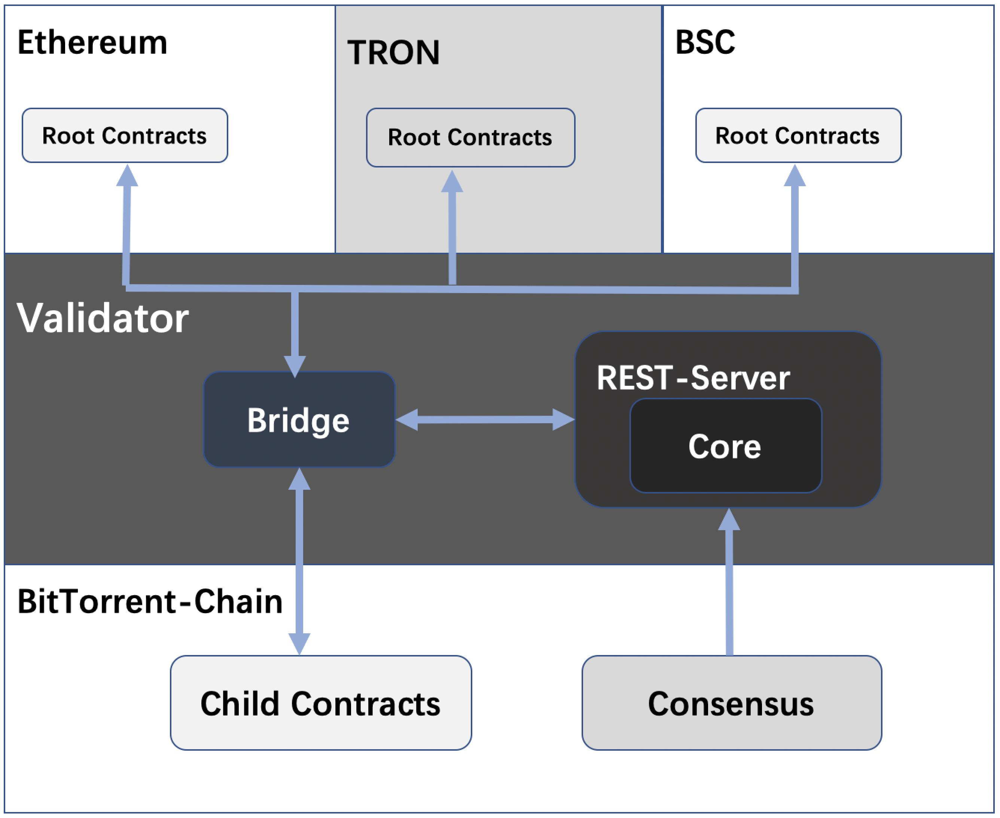

# BTTC架构

BTTC是一个高效的区块链应用平台。

我们将会在各个TRON上部署多套用于管理质押的合约，与参与到BTTC网络中的验证者一起，确保平台PoS机制的运行。TRON将是BTTC支持的第一个basechain，但BTTC的生态将不仅于此，我们将根据社区的建议，为更多的公共区块链提供支持。

BTTC具有三层架构：

1. TRON上的智能合约（质押链）

2. 验证层

3. BTTC侧链

## BTTC智能合约

BTTC在TRON上部署了一套智能合约，管理下面的事务：

+ PoS层质押

+ 验证者份额委托

+ 侧链checkpoint

## PoS验证层

验证节点与TRON上的质押合约协同工作，以在BTTC网络上启用PoS机制。我们使用了TenderMint引擎并在其之上进行了必要的修改。验证层负责区块验证，出块者选择以及提交CheckPoint等各种重要任务。

验证层将侧链生产的区块聚合成默克尔树，并定期将其发送至TRON。这种定期发送的内容就是checkpoint。对于侧链上的每几个区块，一个验证层节点需要：

+ 验证上个checkpoint之后的所有区块

+ 创建基于区块哈希的默克尔树

+ 将默克尔根（merkle root）发送至TRON

checkpoint非常重要，有下面两个原因：

+ 在提取资产时提供燃烧证明

+ 在TRON上提供终结性

下面是对上述过程的整体描述：

+ 一部分活跃的验证者将被选出，作为下一个区间的出块者。出块者的选举需要获得2/3的同意票。这些验证者将负责生产区块，并将这些区块广播到整个网络。

+ 每个checkpoint包含了给定区间内的所有区块的根。验证节点需要验证这些根，并在通过验证之后对其签名。

+ 一名提议人将在验证者中产生。提议人负责收集特定checkpoint的所有签名，并将这些签名提交到TRON上。

+ 每个验证者获得出块以及提交检查点权力的概率，取决于该验证者的权益比重。

## 区块生产层（侧链）

BTTC的区块生产层负责将交易打包进区块中。

验证层的委员会定期选出下一个span中的产块者。区块由侧链的节点产生，并且侧链的虚拟机与以太坊虚拟机完全兼容。验证层节点会周期性的验证侧链区块，一个包含数个区块默克尔哈希的checkpoint也会被周期性的提交到TRON上。
