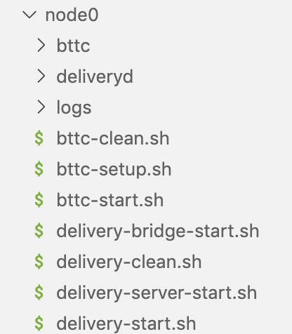

# 节点部署

## 相关依赖及工具

- Git v2.30.1
- g++
- Go 1.16 +
- Nodejs v11.0
- Rabbitmq(latest stable version)

## 编译安装Delivery和BTTC二进制包

::: tip NOTE
部署需要的创世配置以及节点id等，均放在[launch仓库](https://github.com/bttcprotocol/launch.git)
:::

### clone delivery代码

```sh
git clone https://github.com/bttcprotocol/delivery.git
```

### 安装delivery

```sh
cd delivery
make install
```

### clone BTTC代码

```sh
git clone https://github.com/bttcprotocol/bttc
```

### 安装BTTC

```sh
cd bttc
make bttc
```

## 安装bttc-cli脚本

::: tip NOTE
当bttc-cli有更新时，请先卸载本地旧版本，再重新安装最新版本。
:::

```sh
npm uninstall -g bttc-cli
npm install -g @tronnetwork/bttc-cli
```

### 检查bttc-cli版本

```sh
bttc-cli -V
```

## 部署节点

使用如下命令初始化节点目录：

```sh
bttc-cli setup devnet
```

然后依次填写以下问题，请注意主网和测试网的区别

### BTTC测试网（Donau, 1029）

```sh
Please enter Bttc chain id  1029
? Please enter Delivery chain id delivery-1029
? Please enter Bttc branch or tag master
? Please enter Delivery branch or tag master
? Please enter Contracts branch or tag master
? Please enter number of validator nodes 1
? Please enter number of non-validator nodes 0
? Please enter ETH url
? Please select devnet type remote
? Please enter comma separated hosts/IPs localhost
```

运行上述脚本后，会生成如下的node目录



## validator配置

假设节点的根目录在`/data/bttc/node0`。

### 配置delivery种子节点

#### 节点API_KEY配置

修改delivery-config文件
目录：`/data/bttc/node0/deliveryd/config/delivery-config.toml`

**配置说明：**

- eth_rpc_url: 为自己申请的API_KEY地址，需要自己生成 INFURA_KEY 以便跟以太坊通信。[API_KEY申请教程](https://ethereumico.io/knowledge-base/infura-api-key-guide)

- tron_rpc_url: TRON网络节点的RPC地址。

- tron_grid_url: TRON网络查询节点。

- bsc_rpc_url：BSC网络节点的RPC地址。

**DEMO：**

```conf
vim /data/bttc/node0/deliveryd/config/delivery-config.toml
  
eth_rpc_url = "https://goerli.infura.io/v3/<YOUR_INFURA_KEY>"
bsc_rpc_url = "https://data-seed-prebsc-1-s1.binance.org:8545/"
tron_rpc_url = "47.252.19.181:50051"
tron_grid_url = "http://172.18.1.136:8547"
```

#### 替换创世文件配置

将[launch仓库](https://github.com/bttcprotocol/launch.git)中的delivery-genesis.json替换至路径：`/data/bttc/node0/deliveryd/config/genesis.json`。

#### 添加delivery层的node-id

修改配置文件`/data/bttc/node0/deliveryd/config/config.toml`的seeds字段。在[这里](https://github.com/bttcprotocol/launch/tree/master/testnet-1029/without-sentry/delivery)查看seed信息。

### 启动Delivery节点

#### 启动delivery

```sh
nohup sh delivery-start.sh>>logs/deliveryd.log 2>&1 &
```

#### 启动后续服务

```sh
nohup sh delivery-server-start.sh>>logs/rest-server.log 2>&1 &
nohup sh delivery-bridge-start.sh>>logs/bridge.log 2>&1 &
```

### 配置BTTC种子节点

#### 替换BTTC的创世文件

BTTC创世文件路径:`/data/bttc/node0/bttc/genesis.json`

将[launch仓库](https://github.com/bttcprotocol/launch.git)中的`bttc-genesis.json`替换至上述路径。

#### 添加BTTC网络种子节点的node-id

将[launch仓库](https://github.com/bttcprotocol/launch.git)中`static-nodes.json`替换到`/data/bttc/node0/bttc/static-nodes.json`。

### 初始化BTTC节点

```sh
sh bttc-setup.sh
```

### 启动BTTC节点

```sh
nohup sh bttc-start.sh >>logs/bttc-start.log 2>&1 &
```
