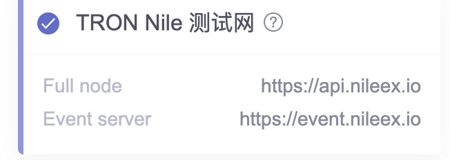
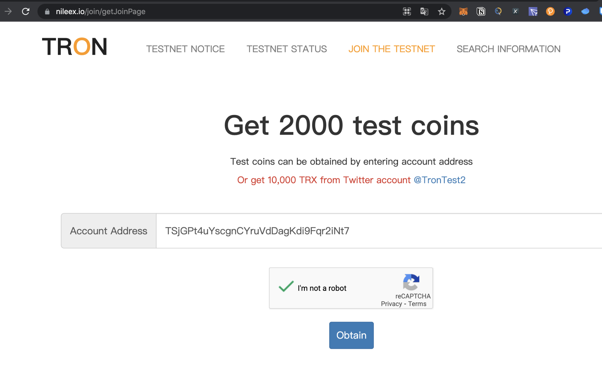
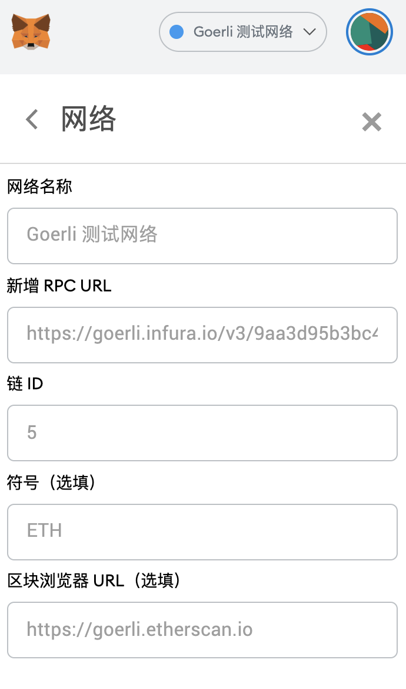
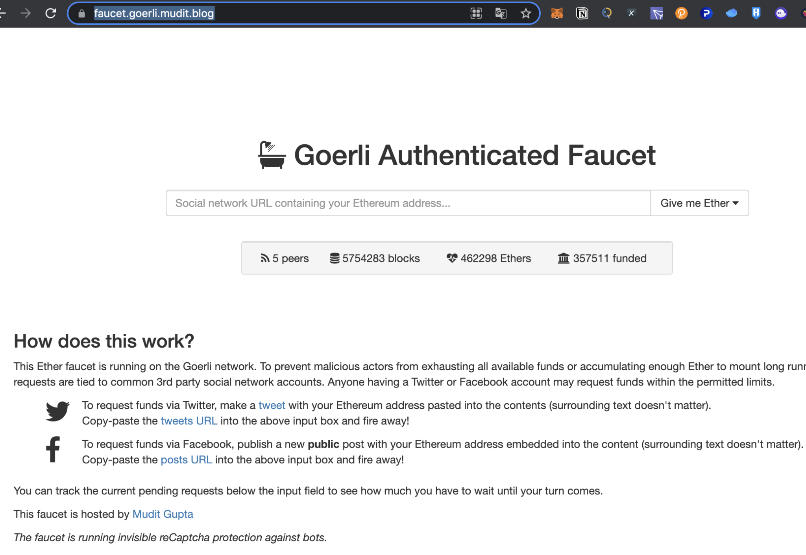
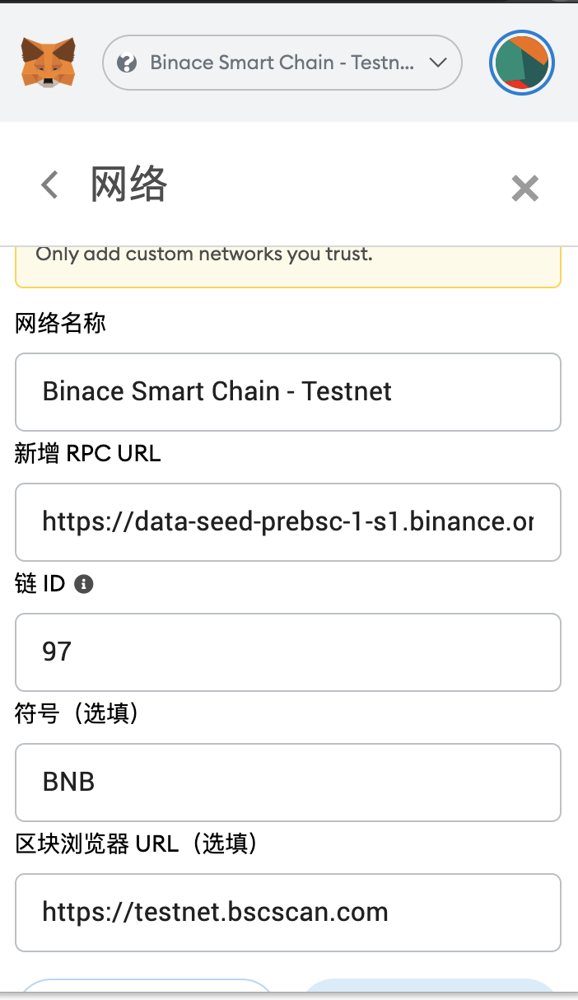
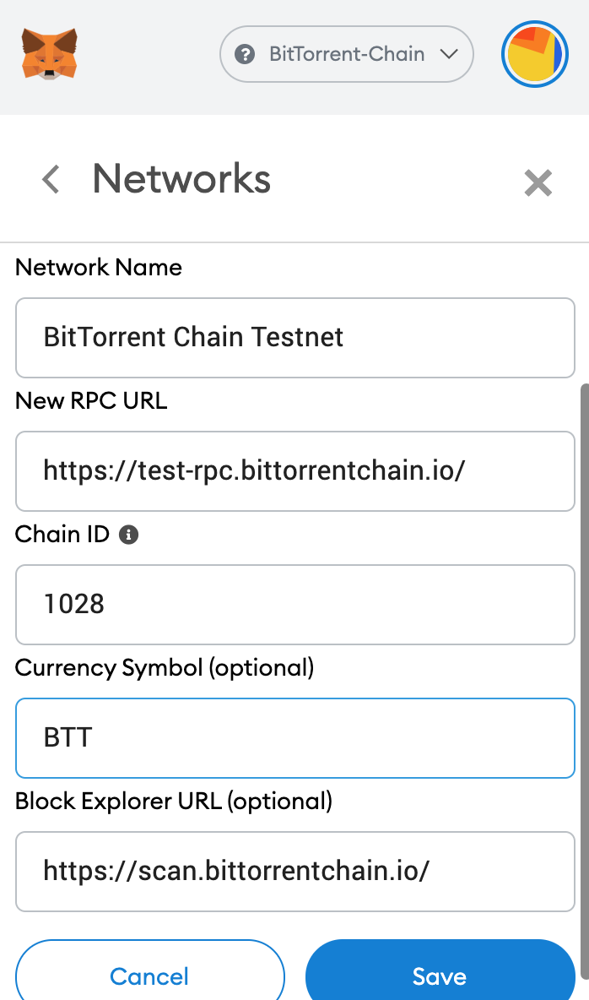
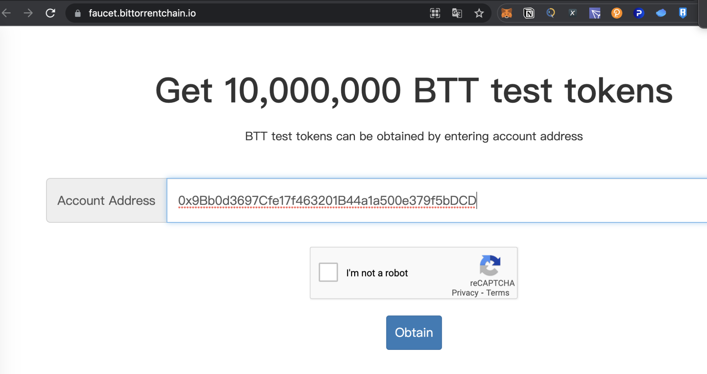

# BTTC测试网络设置

目前BTTC测试网需要使用如下相关测试网：

* TRON：Nile测试网
* ETH：Goerli测试网
* BSC：BSC测试网

## 测试网水龙头

| 网络  |  测试网络名称 |  URL |  备注 |
| ------------ | ------------ | ------------ | ------------ |
| TRON  | Nile  |  [Nile Faucet](https://nileex.io/join/getJoinPage) |   |
|  ETH |  Goerli | [Goerli Faucet](https://faucet.goerli.mudit.blog/)  |  需Twitter |
|  BSC |  BSC测试网 | [BSC Faucet](https://testnet.binance.org/faucet-smart)  |   |
|  BTTC | BTTC测试网  | [BTTC Faucet](https://faucet.bittorrentchain.io)  |   TBD |

## TRON

Full Node: https://api.nileex.io
Event Server: https://event/nilllex.io

### 测试币申请示例

## ETH

网络名称（ Network Name）：Goerli - Testnet
新的RPC URL（ New RPC URL）：https://goerli.infura.io/v3/9aa3d95b3bc440fa88ea12eaa4456161
智能链ID（ChainID）：5
符号（Symbol）：ETH
区块浏览器URL（Block Explorer URL）：https://goerli.etherscan.com

### 测试币申请示例

## BSC

网络名称（ Network Name）：Binace Smart Chain - Testnet
新的RPC URL（ New RPC URL）：https://data-seed-prebsc-1-s1.binance.org:8545/
智能链ID（ChainID）：97
符号（Symbol）：BNB
区块浏览器URL（Block Explorer URL）：https://testnet.bscscan.com

### 测试币申请示例

## BTTC

网络名称（ Network Name）：BitTorrent Chain Testnet
新的RPC URL（ New RPC URL）：https://test-rpc.bittorrentchain.io/ 
智能链ID（ChainID）：1028
符号（Symbol）：BTT
区块浏览器URL（Block Explorer URL）：https://scan.bittorrentchain.io/

### 测试币申请示例

