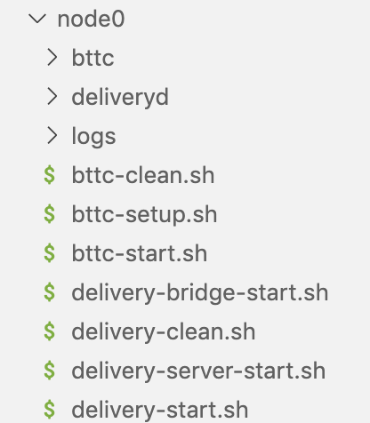

# 節點部署

## 相關依賴及工具

- Git v2.30.1
- g++
- Go 1.16 +
- Nodejs v11.0
- Rabbitmq(latest stable version)

## 編譯安裝Delivery和BTTC二進制包

::: tip NOTE
部署需要的創世配置以及節點id等，均放在[launch倉庫](https://github.com/bttcprotocol/launch.git)
:::

### clone delivery代碼

```sh
git clone https://github.com/bttcprotocol/delivery.git
```

### 安裝delivery

```sh
cd delivery
make install
```

### clone BTTC代碼

```sh
git clone https://github.com/bttcprotocol/bttc
```

### 安裝BTTC

```sh
cd bttc
make bttc
```

## 安裝bttc-cli腳本

::: tip NOTE
當bttc-cli有更新時，請先卸載本地舊版本，再重新安裝最新版本。
:::

```sh
npm uninstall -g bttc-cli
npm install -g @bttcnetwork/bttc-cli
```

### 檢查bttc-cli版本

```sh
bttc-cli -V
```

## 部署節點

使用如下命令初始化節點目錄：

```sh
bttc-cli setup devnet
```

然後依次填寫以下問題，請注意主網和測試網的區別

### BTTC測試網（Donau, 1029）

```sh
Please enter Bttc chain id  1029
? Please enter Delivery chain id delivery-1029
? Please enter Bttc branch or tag master
? Please enter Delivery branch or tag master
? Please enter Contracts branch or tag master
? Please enter number of validator nodes 1
? Please enter number of non-validator nodes 0
? Please enter ETH url
? Please select devnet type remote
? Please enter comma separated hosts/IPs localhost
```

運行上述腳本後，會生成如下的node目錄



## validator配置

假設節點的根目錄在`/data/bttc/node0`。

### 配置delivery種子節點

#### 節點API_KEY配置

修改delivery-config文件
目錄：`/data/bttc/node0/deliveryd/config/delivery-config.toml`

**配置說明：**

- eth_rpc_url: 為自己申請的API_KEY地址，需要自己生成 INFURA_KEY 以便跟以太坊通信。 [API_KEY申請教程](https://ethereumico.io/knowledge-base/infura-api-key-guide)

- tron_rpc_url: TRON網絡節點的RPC地址。

- tron_grid_url: TRON網絡查詢節點。

- bsc_rpc_url：BSC網絡節點的RPC地址。

**DEMO：**

```conf
vim /data/bttc/node0/deliveryd/config/delivery-config.toml
  
eth_rpc_url = "https://goerli.infura.io/v3/<YOUR_INFURA_KEY>"
bsc_rpc_url = "https://data-seed-prebsc-1-s1.binance.org:8545/"
tron_rpc_url = "47.252.19.181:50051"
tron_grid_url = "http://172.18.1.136:8547"
```

#### 替換創世文件配置

將[launch倉庫](https://github.com/bttcprotocol/launch.git)中的delivery-genesis.json替換至路徑：`/data/bttc/node0/deliveryd/config/genesis.json`。

#### 添加delivery層的node-id

修改配置文件`/data/bttc/node0/deliveryd/config/config.toml`的seeds字段。在[這裡](https://github.com/bttcprotocol/launch/tree/master/testnet-1029/without-sentry/delivery)查看seed信息。

### 啟動Delivery節點

#### 啟動delivery

```sh
nohup sh delivery-start.sh>>logs/deliveryd.log 2>&1 &
```

#### 啟動後續服務

```sh
nohup sh delivery-server-start.sh>>logs/rest-server.log 2>&1 &
nohup sh delivery-bridge-start.sh>>logs/bridge.log 2>&1 &
```

### 配置BTTC種子節點

#### 替換BTTC的創世文件

BTTC創世文件路徑:`/data/bttc/node0/bttc/genesis.json`

將[launch倉庫](https://github.com/bttcprotocol/launch.git)中的`bttc-genesis.json`替換至上述路徑。

#### 添加BTTC網絡種子節點的node-id

將[launch倉庫](https://github.com/bttcprotocol/launch.git)中`static-nodes.json`替換到`/data/bttc/node0/bttc/static-nodes.json`。

### 初始化BTTC節點

```sh
sh bttc-setup.sh
```

### 啟動BTTC節點

```sh
nohup sh bttc-start.sh >>logs/bttc-start.log 2>&1 &
```
