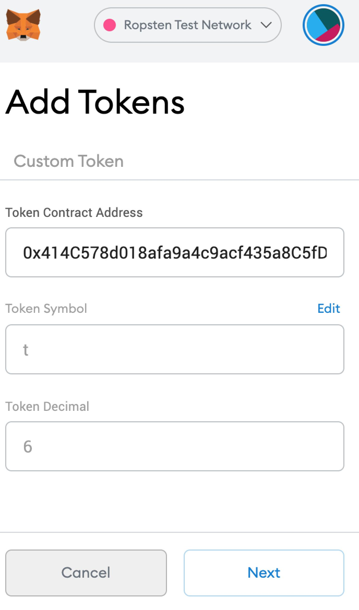
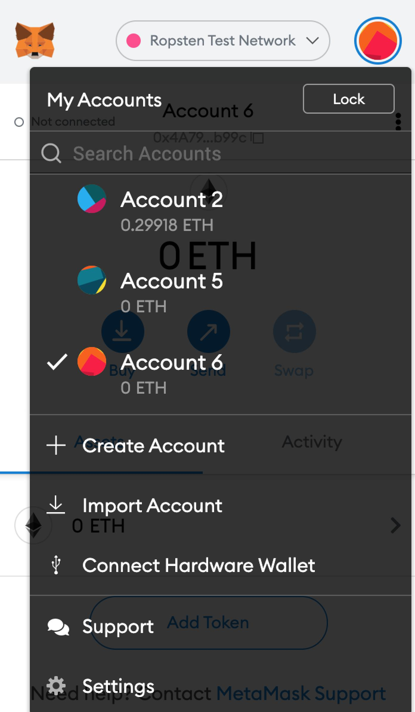

# 钱包

钱包用于客户端对您在BTTC上的dApp集成管理。

在BTTC生态中，主要会用到两种钱包：

* TronLink
* MetaMask

## TronLink

TronLink是功能最全面的去中心化TRON钱包。支持波场的全部常用功能。TronLink有开放的SDK，支持测试网及自定义网络。同时，TronLink受到TRON核心开发团队的支持，与TRON主网无缝对接。

类型：非托管

私钥存储：本地

与TRON的通信：TronGrid HTTP API

我们推荐使用TronLink来管理您在TRON网络上的资产。关于TronLink的集成，请参照TRON官方文档：

* [TronWeb入门]([https://cn.developers.tron.network/docs/%E5%85%A5%E9%97%A8_new](https://cn.developers.tron.network/docs/%E5%85%A5%E9%97%A8_new))

* [TronLink集成]([https://cn.developers.tron.network/docs/%E4%BB%8B%E7%BB%8D-2](https://cn.developers.tron.network/docs/%E4%BB%8B%E7%BB%8D-2))

## MetaMask

MetaMask是一个免费且安全的钱包，它允许web程序与多种区块链交互。

在使用前，请先在[MetaMask官网](https://metamask.io/)下载钱包，将它的Chrome扩展添加到本地的Google Chrome中。

接下来请在已经安装好的MetaMask中创建一个新账号。请妥善保管自己的密码，私钥以及助记词，不要把它们告诉任何人。

### 在MetaMask上配置BTTC

为了查看账户资金在BTTC上的活动，需要在MetaMask上配置BTTC的URL。

要添加BTTC的主网，请在这里选择自定义RPC。


在打开的表单中，请按照下图的内容填写，以正确添加BTTC的主网。

TBD: 添加主网到metamask

### 配置自定义代币

以下内容描述了在MetaMask上配置自定义代币的过程。您可以用这种方法将任何自定义ERC-20代币添加到MetaMask上的任何网络。

在MetaMask中选择Add Token，此处添加的Token为部署在以太坊Ropsten测试网的Test Token，代号为t，地址是`0x414C578d018afa9a4c9acf435a8C5fD042203901`，此代币仅用于演示。填入代币地址后，其他信息会自动补全，如图：



添加完成后，这个代币将显示在您MetaMask的账户中。

将BTTC上的代币添加到MetaMask的操作与上述基本一致，只需要在添加前，在自定义RPC中输入BTTC的正确URL：TBD：RPCURL

### 多个账户

如果您是初次使用MetaMask，这篇文章会教您如何创建多个账户。

点击右上角的圆形图案，并点击Create Account，如图：



接下来在窗口中输入账户名（可以使用任何名字）即可。

### 集成

#### 设置Web3

在您的dApp中安装web3：

```sh
npm install --save web3
```

新建一个名为web3.js的文件，然后输入如下的代码：

```js
import Web3 from 'web3';

const getWeb3 = () => new Promise((resolve) => {
 window.addEventListener('load', () => {
   let currentWeb3;

   if (window.ethereum) {
     currentWeb3 = new Web3(window.ethereum);
     try {
       // Request account access if needed
       window.ethereum.enable();
       // Acccounts now exposed
       resolve(currentWeb3);
     } catch (error) {
       // User denied account access...
       alert('Please allow access for the app to work');
     }
   } else if (window.web3) {
     window.web3 = new Web3(web3.currentProvider);
     // Acccounts always exposed
     resolve(currentWeb3);
   } else {
     console.log('Non-Ethereum browser detected. You should consider trying MetaMask!');
   }
 });
});

export default getWeb3;
```

上面的代码中`exports`的`getWeb3`函数，其作用是通过检测MetaMask注入的全局对象（ethereum或web3）来请求MetaMask账户的访问权限。

MetaMask的文档有一段这样的描述：

MetaMask injects a global API into websites visited by its users at window.ethereum (Also available at window.web3.currentProvider for legacy reasons). This API allows websites to request user login, load data from blockchains the user has a connection to, and suggest the user sign messages and transactions. You can use this API to detect the user of a web3 browser.

接下来，在客户端代码中，导入上面的文件：

```js
  import getWeb3 from '/path/to/web3';
```

调用如下的方法：

```js
  getWeb3()
    .then((result) => {
      this.web3 = result;
    });
```

#### 设置账户

当发送非查询类的交易时，需要一个账户（私钥）为这些交易签名。

```js
  this.web3.eth.getAccounts()
  .then((accounts) => {
    this.account = accounts[0];
  })
```

`getAccounts()`将返回用户MetaMask上所有的账户，`accounts[0]`则是其中的第一个账户。

#### 实例化合约

现在我们已经有了一个web3对象，接下来需要实例化合约，这需要合约的ABI以及地址。

```js
const myContractInstance = new this.web3.eth.Contract(myContractAbi, myContractAddress)
```

#### 调用合约

现在我们可以通过实例化的合约对象，来调用合约中的方法。

改变链上状态的方法被称为send()方法，查询类的方法被称为call()方法。

##### 调用call()方法

```js
  this.myContractInstance.methods.myMethod(myParams)
  .call()
  .then (
    // do stuff with returned values
  )
```

##### 调用send()方法

```js
  this.myContractInstance.methods.myMethod(myParams)
  .send({
    from: this.account,gasPrice: 0
  })
  .then (
    (receipt) => {
      // returns a transaction receipt}
    )
```
